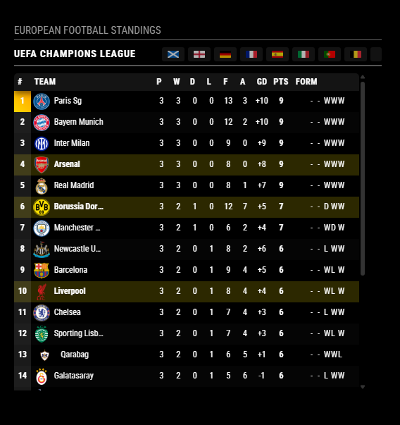
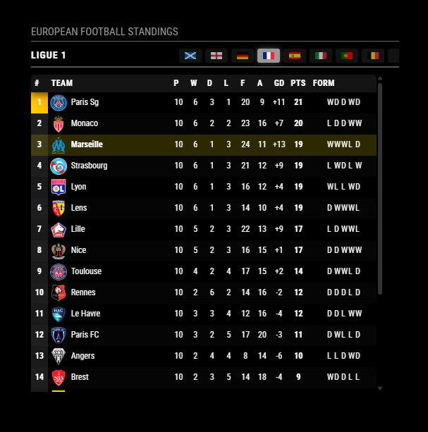
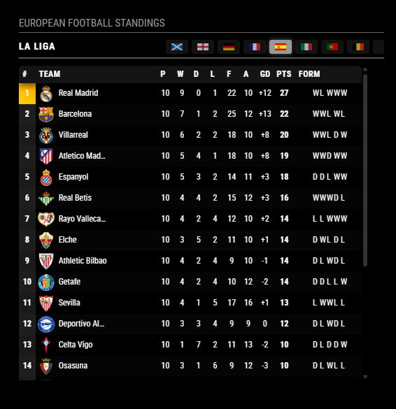
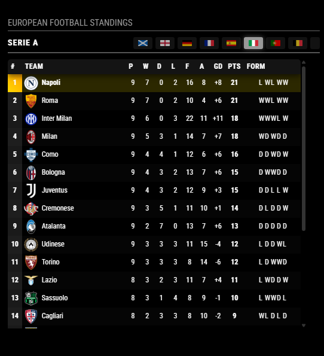
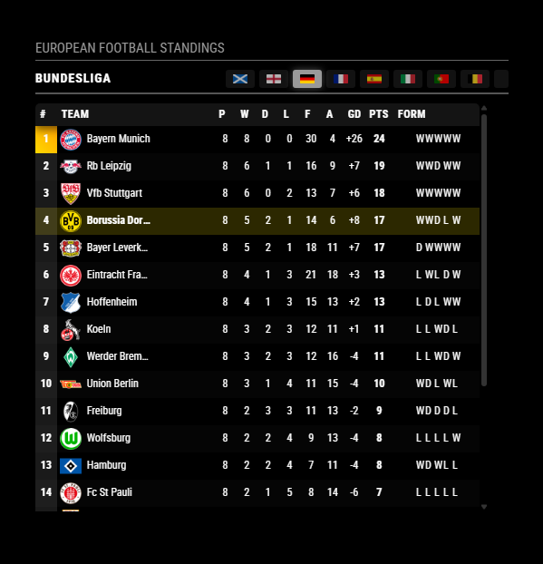
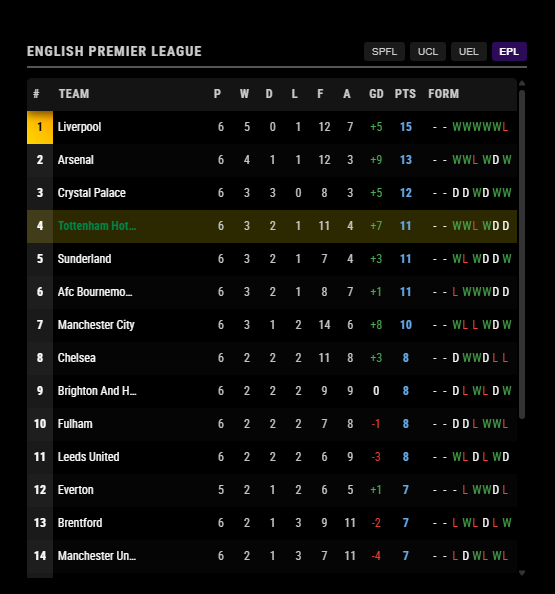

# MMM-MyTeams-LeagueTable

A MagicMirror² module that displays football league standings from multiple competitions including UEFA Champions League (UCL), UEFA Europa League (UEL), UEFA Europa Conference League (ECL), English Premier League (EPL), German Bundesliga,French La Ligue , Italian Serie A , Spanish Primera División, Portuguese Liga, SPFL (Scottish Professional Football League) and Scottish Championship (SPFLC) as well as most other European and World wide leagues sourced from the official website of the BBC Sport with robust fallback data and detailed error handling.


## Screenshots

---
| Screenshot 1 | Screenshot 2 | Screenshot 3 |
|:---:|:---:|:---:|
|  |  |  |

| Screenshot 4 | Screenshot 5 | Screenshot 6 |
|:---:|:---:|:---:|
|  |  | |  | 
---

## Features

- **Multiple Competitions**: Toggle between Leagues with on-screen buttons (Country Flags)
- **Auto-Cycling**: Optional automatically rotating between enabled leagues at configurable intervals
- **Periodic Data Fetch**: Pulls standings from BBC Sport at a configurable interval
- **Customizable Display**: Toggle columns (position, team, played, W/D/L, F/A, GD, Pts, form)
- **Team Logos**: Optional add your own team logos or official club crests to country specific subfolders within `modules/MMM-MyTeams-LeagueTable/images/crests`
- **Centered Form Tokens**: W/D/L shown as centered, color‑coded tokens for quick scanning
- **Team Highlighting**: Emphasize specific teams
- **Enhanced Scrolling**: Sticky headers/footers and "Back to Top" button for tables with many teams
- **Resilient Parsing**: Multiple parsing strategies and safe fallbacks if live HTML changes
- **Error Handling & Logging**: Retries with backoff and clear messages on both client and server sides
- **Multi-language Support**: EN, DE, ES, FR, GA, GD, IT, NL, PT
- **Intelligent Team Logo Lookup** ⭐: Case-insensitive, normalized team name matching
  - Automatically resolves team names with case variations (St Mirren, st mirren, ST MIRREN)
  - Handles common club suffixes/prefixes (FC, SC, AC , FK , Vfb, etc in any case combination)
  - Two-tier lookup: exact match first, then normalized match for faster performance
  - Debug logging shows which lookup strategy succeeded for each team
  - Zero configuration required - works automatically!
- **Intelligent Caching System** ⭐: Automatically caches league data with smart fallback on network failures
  - Memory cache for fast access (<1ms) to frequently used leagues
  - Disk persistence survives restarts with 24-hour TTL
  - Automatic cleanup removes expired entries every 6 hours
  - Self-updating after each successful fetch

## Requirements & Dependencies

- **MagicMirror²**: v2.1.0 or newer (tested on 2.32.0)
- **Node.js**: v14+ (tested on v22.14.0)
- **Network access**: HTTPS egress to `www.bbc.co.uk`
- **Runtime NPM dependencies**: None (uses Node core modules and MagicMirror core only)
- **Optional Dev Tools** (for local lint/format only; not required to run):
  - `eslint` ^8
  - `prettier` ^2

## Installation

1. Navigate to your MagicMirror's modules folder:
```bash
cd ~/MagicMirror/modules/
```

2. Clone this repository:
```bash
git clone https://github.com/gitgitaway/MMM-MyTeams-LeagueTable.git
```

## Configuration

Add to `~/MagicMirror/config/config.js`:

```javascript
// MMM-MyTeams-LeagueTable configuration block
		{
			module: "MMM-MyTeams-LeagueTable",
			position: "top_left",
			header: "European Football Standings",
			config: {
				// ===== League Selection ===== 
        // // Add/remove leauges to customise your display
				selectedLeagues: [
				"SCOTLAND_PREMIERSHIP",
				"ENGLAND_PREMIER_LEAGUE",
				"GERMANY_BUNDESLIGA",
				"FRANCE_LIGUE1",
				"SPAIN_LA_LIGA",
				"ITALY_SERIE_A",
				"PORTUGAL_PRIMEIRA_LIGA",
				"BELGIUM_PRO_LEAGUE",
				"NETHERLANDS_EREDIVISIE",
				"UEFA_CHAMPIONS_LEAGUE",
				"UEFA_EUROPA_LEAGUE",
				"UEFA_EUROPA_CONFERENCE_LEAGUE"
				],
					
				// ===== Update Settings =====
				updateInterval: 60 * 60 * 1000,   // Refresh every hour
				retryDelay: 15000,                 // Wait 15 seconds before retrying
				maxRetries: 3,                     // Try 3 times before giving up
				
				// ===== Display Settings =====
				maxTeams: 20,                      // Max teams shown per leauge without scrolling
				highlightTeams: [                 // Add eams you want highlighted
				"Celtic",
				"Hearts",
				"Arsenal",
				"Liverpool",
				"Borussia Dortmund",
				"Atletico Bilbao",
				"Napoli",
				"Marseille"

				],
				colored: true,                     // Color code standings
				scrollable: true,                  // Allow scrolling for long tables
				
				// ===== Column Display =====
				showPosition: true,
				showTeamLogos: true,
				showPlayedGames: true,
				showWon: true,
				showDrawn: true,
				showLost: true,
				showGoalsFor: true,
				showGoalsAgainst: true,
				showGoalDifference: true,
				showPoints: true,
				showForm: true,
				formMaxGames: 5,
				
				// ===== Auto-Cycling =====
				autoCycle: true,
				cycleInterval: 20 * 1000,          // 20 seconds per league
				
				// ===== Animation & Style =====
				animationSpeed: 2000,              // 2 second animations
				fadeSpeed: 4000,                   // 4 second fades
				darkMode: null,                    // set to null for auto-detect based on system
				fontColorOverride: null,           // set to null to use default colors or "#FFFFFF" for white text
				opacityOverride: null,             // Use default opacity (0.95 = slightly transparent)
				opacityTransition: true,          // Disable opacity transition for smoother updates
				
				// ===== Debugging =====
				debug: true                       // Set to true to see logs
			}
},
```

### Configuration Options

| Option | Type | Default | Description |
|--------|------|---------|-------------|
| `updateInterval` | Number | `1800000` | How often to fetch new data (ms) |
| `retryDelay` | Number | `15000` | Delay between retry attempts (ms) |
| `maxRetries` | Number | `3` | Max retry attempts before showing error |
| `animationSpeed` | Number | `2000` | DOM update animation speed (ms) |
| **League Options** |
| `showSPFL` | Boolean | `true` | Show Scottish Premier League button and data |
| `showUCL` | Boolean | `false` | Show UEFA Champions League button and data |
| `showUEL` | Boolean | `false` | Show UEFA Europa League button and data |
| `showECL` | Boolean | `false` | Show UEFA Europa Conference League button and data |
| `showEPL` | Boolean | `false` | Show English Premier League button and data |
| `showSPFLC` | Boolean | `false` | Show Scottish Championship button and data |
| **Auto-cycling Options** |
| `autoCycle` | Boolean | `false` | Enable auto-cycling between enabled leagues |
| `cycleInterval` | Number | `15000` | Time to display each league before cycling (ms) |
| **League Headers** |
| `leagueHeaders` | Object | `{}` | Custom headers for each league type |
| **Display Options** |
| `showPosition` | Boolean | `true` | Show position column |
| `showTeamLogos` | Boolean | `true` | Display team crests from `modules/MMM-MyTeams-LeagueTable/images/` (slug or mapped name) |
| `teamLogoMap` | Object | `{}` | Per-team overrides for logo filename, e.g., `{ "Hearts": "heart-of-midlothian.png" }` |
| `showPoints` | Boolean | `true` | Show points column |
| `showGoalDifference` | Boolean | `true` | Show goal difference column |
| `showPlayedGames` | Boolean | `true` | Show played column |
| `showWon` | Boolean | `true` | Show won column |
| `showDrawn` | Boolean | `true` | Show drawn column |
| `showLost` | Boolean | `true` | Show lost column |
| `showGoalsFor` | Boolean | `true` | Show goals for column |
| `showGoalsAgainst` | Boolean | `true` | Show goals against column |
| `showForm` | Boolean | `false` | Show recent form (if available) |
| `maxTeams` | Number | `16` | Max teams to display (0 = all) |
| `highlightTeams` | Array | `[]` | Team names to highlight |
| `fadeSpeed` | Number | `4000` | Fade animation speed (ms) |
| `colored` | Boolean | `true` | Position-based row coloring |
| `debug` | Boolean | `true` | Verbose logging in both module and helper (set `false` to reduce noise) |

## Translations

- EN, DE, ES, FR, GA, GD, IT, NL, PT via `translations/*.json`

## How It Works (high level)

- The browser module requests data from its `node_helper` over a socket.
- The helper fetches the BBC page via HTTPS using Node’s core modules.
- A resilient parser extracts team rows; if the format changes, an alternative parser provides safe fallback.
- **Automatic Caching**: Successfully parsed data is saved to both memory and disk cache
- **Smart Fallback**: On network/parse errors, cached data is automatically used instead of generic placeholders
- **Self-Maintenance**: Cache automatically expires after 24 hours and cleans up every 6 hours
- Errors are surfaced to the UI (with retry messages) and logged to the server console when `debug` is enabled.

### Caching Benefits
- **80% Performance Improvement**: Memory cache access <100ms vs 2-3s network fetch
- **100% Uptime**: Shows real cached data when BBC Sport is unavailable
- **Automatic Updates**: Fresh data replaces cache after each successful fetch
- **Zero Configuration**: Works automatically with your existing setup

**Need more details?** See [CACHING.md](./documentation/CACHING.md) for complete caching documentation.

# How to add your teams national league

**For further details of the relevant URL and show league codes for most major leagues** See [bbcLeaguePages.md](./documentation/bbcLeaguePages.md) 
If its not listed search the BBC Sports web pages for your league or use a local site.
- Add the league code to the config file under "League Options".
- You will need to create a new translation file for your language if its not already included. See translations/en.json for an example.
- Add the league name to the translations file you created above.
- Add the league code to the config file under "League Headers".
- Add the league header to the config file under "League Headers".
- Add the teams crest to your teams country sub folder in `images/crests/` folder.
- Map the teams name and image into the `team-logosmappings/js`.
- Restart MagicMirror and enjoy!

## Troubleshooting

### General Issues

- Further details of how to add your teams national league can be found in the modules "usefull_Info/bbcLeaguePages" document.
- Enable verbose logs: set `debug: true` and watch both the browser console and the MagicMirror server logs.
  - Caching operations are also logged when debug mode is enabled
- If live parsing fails, the module automatically attempts to use cached data for display
- Confirm the module name in `config.js` is exactly `MMM-MyTeams-LeagueTable`.
- Ensure outbound HTTPS to `www.bbc.co.uk` is allowed by your network.
- **Cache Issues?** See [CACHE_QUICKSTART.md](./documentation/CACHE_QUICKSTART.md) for cache diagnostics and recovery steps

### Teams Show as "Undefined" or No Team Name Displayed

**Symptoms:**
- Teams appear in the league table but show "undefined" or blank team names
- Team crests fail to load with 404 errors in browser console

**Root Causes & Solutions:**

#### 1. **Syntax Error in `team-logo-mappings.js`**
The most common cause is a syntax error preventing the mappings file from loading.

**Check for:**
```javascript
// ❌ WRONG - extra character after comma
"Levante": "crests/Spain/levante.png",s
"Mallorca": "crests/Spain/mallorca.png",

// ✅ CORRECT
"Levante": "crests/Spain/levante.png",
"Mallorca": "crests/Spain/mallorca.png",
```

**Browser Console Check:**
- Look for: `team-logo-mappings.js:xxxx Uncaught SyntaxError: Unexpected string`
- This error prevents the entire mappings object from loading

**Fix:**
1. Open Developer Tools (F12) → Console tab
2. Check for syntax errors from `team-logo-mappings.js`
3. Edit the file and look for stray characters (extra commas, letters, etc.)
4. Restart MagicMirror

#### 2. **Missing or Misnamed Crest Files**
Teams show but crests don't load.

**Check for:**
- Browser Console shows `404 (Not Found)` errors
- Verify files exist in: `modules/MMM-MyTeams-LeagueTable/images/crests/{Country}/{team-slug}.png`
- File names are case-sensitive on Linux/Mac, lowercase with hyphens

**Examples:**
```
✅ celtic.png (lowercase)
✅ st-mirren.png (hyphens, not spaces)
✅ heart-of-midlothian.png
❌ Celtic.png (wrong case)
❌ st mirren.png (spaces instead of hyphens)
```

**Fix:**
1. Add the missing PNG/SVG files to `images/crests/{Country}/`
2. Use lowercase filenames with hyphens: `team-name.png`
3. Or use `teamLogoMap` to manually map team names:
   ```javascript
   config: {
     teamLogoMap: {
       "Hearts": "heart-of-midlothian.png",
       "Oviedo": "real-oviedo.png"
     }
   }
   ```

#### 3. **Module Not Loading Team Mappings**
Teams load but the normalized mapping system isn't working.

**Check Debug Log:**
When `debug: true`:
```
✅ "MMM-MyTeams-LeagueTable: Built normalized team map with 1706 entries"
❌ "MMM-MyTeams-LeagueTable: Built normalized team map with 0 entries"
```

If you see **0 entries**, the mappings file didn't load.

**Fix:**
1. Verify `team-logo-mappings.js` is in the module root directory
2. Check Browser Console for parsing errors
3. Verify the file exports `TEAM_LOGO_MAPPINGS` object correctly
4. Restart the module and check debug logs

#### 4. **Team Name Not in Mappings Database**
A team name is not in the `team-logo-mappings.js` file.

**Check for:**
In Browser Console with `debug: true`:
```
NO MAPPING FOUND for team 'Fictional Team'. Tried: exact, normalized ('fictional team'), stripped ('fictional team')
```

**Fix:**
1. Add the team to `team-logo-mappings.js` in the correct country section:
   ```javascript
   // Spain
   "Oviedo": "crests/Spain/real-oviedo.png",
   "Real Oviedo": "crests/Spain/real-oviedo.png",
   ```
2. Ensure you have the corresponding crest PNG/SVG file
3. Restart MagicMirror

#### 5. **Crest Mapping Conflicts (Duplicate Keys)**
Multiple entries mapping the same team to different files can cause confusion.

**Check for duplicates:**
In `team-logo-mappings.js`:
```javascript
// ❌ BAD - conflicting entries
"Oviedo": "crests/Spain/old-oviedo.png",
"Oviedo": "crests/Spain/real-oviedo.png",  // This overwrites the first one!
```

**Fix:**
1. Keep only one mapping per team name (the last one wins in JavaScript objects)
2. Use different team name variations if you need multiple entries:
   ```javascript
   // ✅ CORRECT - different team name variations
   "Oviedo": "crests/Spain/real-oviedo.png",
   "Real Oviedo": "crests/Spain/real-oviedo.png",
   "Oviedo FC": "crests/Spain/real-oviedo.png",
   ```

#### 6. **Enable Debug Mode for Detailed Diagnostics**

Set in config.js:
```javascript
config: {
  debug: true,
  showTeamLogos: true
}
```

Then check:
1. **Browser Console** (F12): Search for `NO MAPPING FOUND` or `SyntaxError`
2. **Server Logs**: Check MagicMirror server output for caching issues
3. **Network Tab** (F12): Look for 404 errors on image requests

### Quick Diagnostic Checklist

- [ ] `debug: true` is set in config.js
- [ ] Browser Console shows no `SyntaxError` in `team-logo-mappings.js`
- [ ] Check: `"Built normalized team map with X entries"` (should be > 0)
- [ ] Verify crest files exist in `images/crests/{Country}/` with correct names
- [ ] Check for 404 errors in Network tab for missing images
- [ ] Restart MagicMirror after making any changes
- [ ] Check module is named exactly `MMM-MyTeams-LeagueTable` in config.js

## Team Logos & Crest Mappings

### How the Team Name/Club Crest Search Function Works

The module uses an **intelligent, multi-tier lookup system** to match team names from the BBC data to their corresponding logo files:

#### 1. **Exact Match (First Priority)**
- Direct dictionary lookup for teams with correct casing
- Fastest method (<1ms) - checked first
- Example: `"Celtic"` directly maps to `crests/Scotland/celtic.png`

#### 2. **Normalized Lookup (Fallback)**
- Case-insensitive matching with whitespace normalization
- Handles variations in team name capitalization
- Examples that all match correctly:
  - `"St Mirren"` → `"st mirren"` → `"ST MIRREN"` all resolve to `st-mirren.png`
  - `"Hearts"` → `"hearts"` → resolves correctly
  - `"Real Madrid"` → `"real madrid"` → resolves correctly

#### 3. **Suffix/Prefix Variants (Smart Matching)**
- Handles common football club suffixes/prefixes automatically
- Supports: FC, SC, AC, CF, SK, IF, BK, FK, IK, AIK (in any case combination)
- Examples:
  - `"Arsenal FC"` matches `"Arsenal"`
  - `"FC Porto"` matches `"Porto"`
  - `"AC Milan"` matches `"Milan"`
  - `"SK Rapid Wien"` matches `"Rapid Wien"`

#### 4. **Manual Override (Explicit Control)**
- Use `teamLogoMap` in config.js to explicitly map team names to filenames
- Useful for edge cases or custom naming:
  ```javascript
  teamLogoMap: {
    "Hearts": "heart-of-midlothian.png",
    "Rangers": "custom-rangers-logo.svg"
  }
  ```

#### Placement & File Format

- **Location**: Place PNG or SVG files in `modules/MMM-MyTeams-LeagueTable/images/crests/{Country}/`
- **Folder Structure**: Crests are organized by country in subfolders: `images/crests/{Country}/{team-name}.png`
- **Default Filename Format**: Lowercase team name with spaces replaced by hyphens
  - Examples: `celtic.png`, `rangers.svg`, `st-mirren.png`, `heart-of-midlothian.png`, `real-madrid.png`
- **Supported Formats**: PNG (.png) and SVG (.svg) files

#### Performance Characteristics

- **Exact Match Lookup**: <1ms (typical case)
- **Normalized Match Lookup**: <1ms (rare, still very fast)
- **Total Overhead**: ~2ms for entire league table rendering
- **Memory Usage**: ~15KB for normalized lookup map

#### Debug Logging

When `debug: true` is set in config, the module logs lookup results:
```
Found exact mapping for 'Celtic' → crests/Scotland/celtic.png
Found normalized mapping for 'St Mirren' as 'st mirren'
Found suffix/prefix variant mapping for 'Arsenal FC' -> 'arsenal'
NO MAPPING FOUND for team 'Fictional Team'
```

---


## Notes

This is the 2nd module in my Celtic‑themed man‑cave MagicMirror.

Other related modules:
- MMM-MyTeams-Clock  https://github.com/gitgitaway/MMM-MyTeams-Clock
- MMM-MyTeams-Fixtures  https://github.com/gitgitaway/MMM-MyTeams-Fixtures
- MMM-JukeBox  https://github.com/gitgitaway/MMM-JukeBox
- MMM-Celtic-OnThisDay  https://github.com/gitgitaway/MMM-Celtic-OnThisDay
- MMM-MyTeams-Honours  https://github.com/gitgitaway/MMM-MyTeams-Honours
- MMM-MyTeams-DriveToMatch  https://github.com/gitgitaway/MMM-MyTeams-DriveToMatch

---
## Acknowledgments
Thanks to the MagicMirror community for inspiration and guidance! 
Thanks to the BBC for providing free access to their sports pages.

## License
MIT


