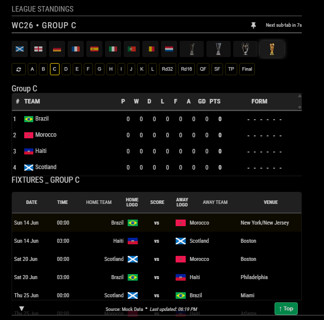
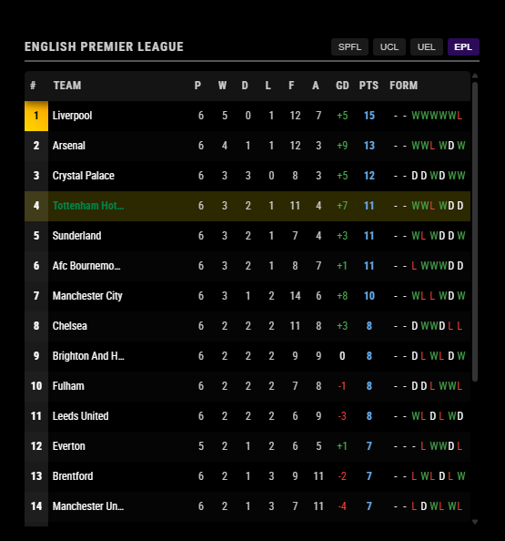
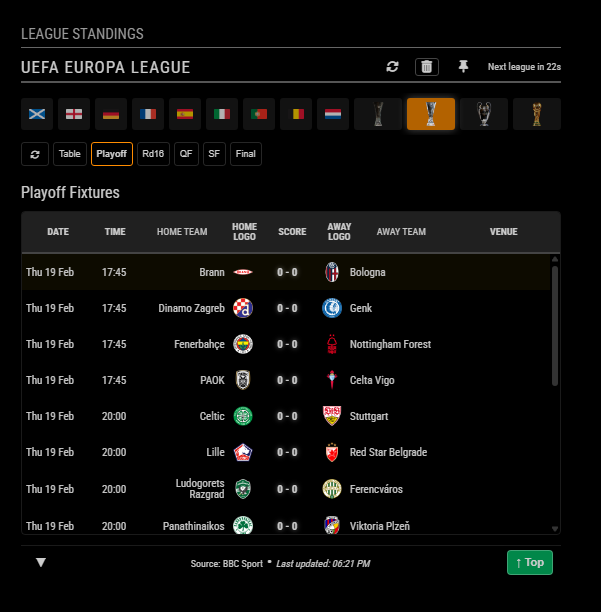
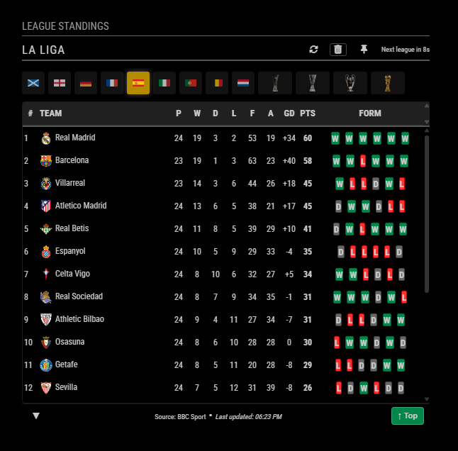
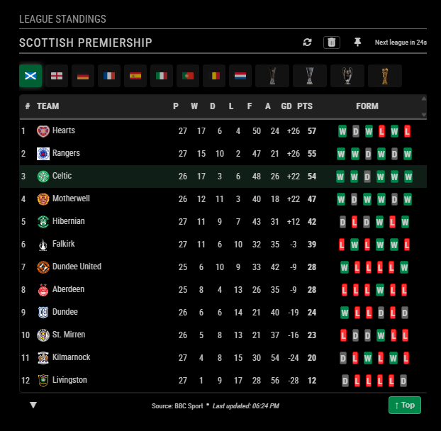
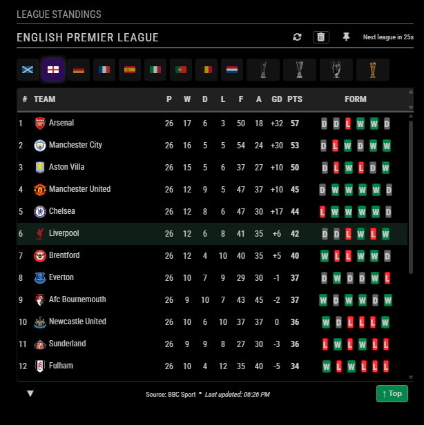
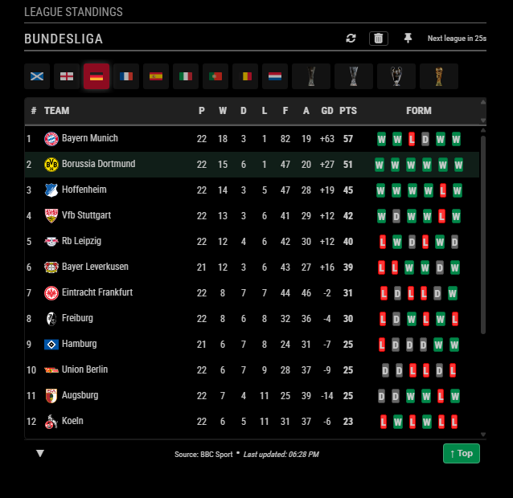

# MMM-MyTeams-LeagueTable

A comprehensive **MagicMirror²** module for displaying football league standings, fixtures, and live results. Supports 20+ domestic leagues, UEFA competitions (Champions League, Europa League, Conference League), and the FIFA World Cup 2026.

[](https://magicmirror.builders)
[](https://opensource.org/licenses/MIT)

## 🎬 Screenshots

| | | |
|:---:|:---:|:---:|
| [](./screenshots/screenshot1.png) | [](./screenshots/screenshot2.png) | [](./screenshots/screenshot3.png) |
| [](./screenshots/screenshot4.png) | [](./screenshots/screenshot5.png) | [](./screenshots/screenshot6.png) |
| [](./screenshots/screenshot7.png) | | |

## 🏆 Key Features

- **Multi-League Support**: Track SPFL, EPL, Bundesliga, La Liga, and 20+ other national leagues.
- **Tournament Modes**: Dedicated views for UEFA Champions League and FIFA World Cup 2026.
- **Intelligent Logo Mapping**: Automatic team crest resolution for over 1,700 teams.
- **Performance Optimized**: Server-side processing, intelligent caching, and smooth CSS transitions.
- **Accessible Design**: Full ARIA support and responsive typography.
- **Stale Data Protection**: Automatic warning indicators if live data cannot be fetched.
- **Auto-Cycling**: Automatically rotate between different leagues or tournament groups.

## 🛠️ Installation

```bash
cd ~/MagicMirror/modules
git clone https://github.com/gitgitaway/MMM-MyTeams-LeagueTable.git
cd MMM-MyTeams-LeagueTable
npm install
```

## ⚙️ Configuration

To use this module, add it to the modules array in the `config/config.js` file:

### Minimum Configuration
```javascript
{
  module: "MMM-MyTeams-LeagueTable",
  position: "top_right",
  config: {
    selectedLeagues: ["SCOTLAND_PREMIERSHIP"]
  }
},
```

### Full Configuration
```javascript
{
  module: "MMM-MyTeams-LeagueTable",
  position: "top_right",
  header: "Football Standings",
  config: {
    updateInterval: 30 * 60 * 1000,
    selectedLeagues: ["SCOTLAND_PREMIERSHIP", "ENGLAND_PREMIER_LEAGUE", "UEFA_CHAMPIONS_LEAGUE", "WORLD_CUP_2026"],
    autoCycle: true,
    cycleInterval: 20000,
    highlightTeams: ["Celtic", "Liverpool", "Scotland"],
    maxTeams: 12,
    showTeamLogos: true,
    showForm: true,
    formMaxGames: 6,
    colored: true,
    showLeagueButtons: true,
    autoFocusRelevantSubTab: true,
    maxTableHeight: 600
  }
},
```

### Configuration Options

#### Core Options
| Option | Default | Description |
|:--- |:--- |:--- |
| `updateInterval` | `1800000` (30m) | How often to refresh data (in milliseconds). |
| `selectedLeagues` | `["SCOTLAND_PREMIERSHIP"]` | Array of league codes to display. |
| `highlightTeams` | `["Celtic", "Hearts"]` | Array of team names to visually emphasize. |
| `maxTeams` | `36` | Maximum number of teams to show (0 for all). |
| `scrollable` | `true` | Enable vertical scrolling if max height exceeded. |
| `maxTableHeight` | `460` | Height in px before scrolling kicks in. |

#### Display Toggles
| Option | Default | Description |
|:--- |:--- |:--- |
| `showTeamLogos` | `true` | Show/hide team crests. |
| `showPosition` | `true` | Show/hide league rank. |
| `showPlayedGames`| `true` | Show games played column. |
| `showWon` / `showDrawn` / `showLost` | `true` | Toggle W/D/L columns. |
| `showGoalsFor` / `showGoalsAgainst` | `true` | Toggle GF/GA columns. |
| `showGoalDifference` | `true` | Show GD column. |
| `showPoints` | `true` | Show points column. |
| `showForm` | `true` | Show recent match results (W/D/L). |
| `formMaxGames` | `6` | Number of recent games to show in form column. |
| `colored` | `true` | Color-code rows (Promotion/UEFA/Relegation zones). |
| `showLeagueButtons`| `true` | Show/hide the interactive tabs in the header. |

#### Cycling Options
| Option | Default | Description |
|:--- |:--- |:--- |
| `autoCycle` | `false` | If true, automatically rotate through selected leagues. |
| `cycleInterval` | `15000` (15s) | Time to display each league during auto-cycling. |
| `autoCycleWcSubtabs`| `true` | Allow auto-cycling of World Cup sub-tabs (groups/knockouts). |
| `wcSubtabCycleInterval`| `15000` | Time to display each WC sub-tab. |

#### Tournament Specific (World Cup 2026 & UEFA)
| Option | Default | Description |
|:--- |:--- |:--- |
| `showWC2026` | `false` | Show World Cup 2026 in league switcher. |
| `showUEFAleagues` | `false` | Show UEFA leagues in league switcher. |
| `onlyShowWorldCup2026`| `false` | Force module into dedicated World Cup mode. |
| `autoFocusRelevantSubTab`| `true` | Automatically focus on live or upcoming matches. |
| `showWC2026Groups` | `["A"..."L"]` | Array of groups to display. |
| `showWC2026Knockouts`| `["Rd32"..."Final"]` | Knockout rounds to show. |
| `showUEFAnockouts` | `["Playoff"..."Final"]` | UEFA knockout stages to show. |

## ⚽ Available Leagues

Use these codes in your `selectedLeagues` array:

- **UK**: `SCOTLAND_PREMIERSHIP`, `SCOTLAND_CHAMPIONSHIP`, `ENGLAND_PREMIER_LEAGUE`
- **Major Europe**: `GERMANY_BUNDESLIGA`, `SPAIN_LA_LIGA`, `ITALY_SERIE_A`, `FRANCE_LIGUE1`, `NETHERLANDS_EREDIVISIE`
- **Other Europe**: `PORTUGAL_PRIMEIRA_LIGA`, `BELGIUM_PRO_LEAGUE`, `TURKEY_SUPER_LIG`, `GREECE_SUPER_LEAGUE`, `AUSTRIA_BUNDESLIGA`, `CZECH_LIGA`, `DENMARK_SUPERLIGAEN`, `NORWAY_ELITESERIEN`, `SWEDEN_ALLSVENSKAN`, `SWITZERLAND_SUPER_LEAGUE`, `UKRAINE_PREMIER_LEAGUE`, `ROMANIA_LIGA_I`, `CROATIA_HNL`, `SERBIA_SUPER_LIGA`, `HUNGARY_NBI`, `POLAND_EKSTRAKLASA`
- **International/UEFA**: `UEFA_CHAMPIONS_LEAGUE`, `UEFA_EUROPA_LEAGUE`, `UEFA_EUROPA_CONFERENCE_LEAGUE`, `WORLD_CUP_2026`

## 📚 Detailed Documentation

### Core Documentation
- **[How This Module Works](./documentation/How_This_Module_Works.md)**: Architectural overview.
- **[Configuration User Guide](./documentation/Configuration_User_Guide.md)**: Detailed configuration options.
- **[Advanced Customization](./documentation/Advanced_Customization.md)**: CSS variables and manual logo mapping.
- **[Troubleshooting](./documentation/Troubleshooting_User_Guide.md)**: Common issues and solutions.
- **[Translation Guide](./documentation/Translation-Guide.md)**: Language support and localization.
- **[Accessibility Features](./documentation/Accessibility_Features.md)**: Screen reader and visual aid details.

### Tournament & League Guides
- **[World Cup 2026 Guide](./documentation/WorldCup2026-UserGuide.md)**: Tournament specific details.
- **[European Leagues Config](./documentation/EUROPEAN_LEAGUES_CONFIG.md)**: Details on European league setup.
- **[BBC League Pages](./documentation/bbcLeaguesPages.md)**: Reference list of supported league pages.

### Technical References
- **[Cache Quickstart](./documentation/CACHE_QUICKSTART.md)**: Guide to the module's caching system.
- **[Mock Data Guide](./documentation/MOCK_DATA_GUIDE.md)**: How to use mock data for testing.
- **[Shared Request Manager](./documentation/SHARED_REQUEST_MANAGER.md)**: Technical details of the data fetching system.
- **[Code of Conduct](./documentation/Code_Of_Conduct.md)**: Contributor guidelines.

### Project Files
- **[Changelog](./CHANGELOG.md)**: History of changes and versions.
- **[Final Review](./Final_Review.md)**: Final implementation review.
- **[License](./LICENSE)**: MIT License details.

## 📝 License & Acknowledgments

- **License**: MIT
- **Data Source**: BBC Sport / FIFA
- **Community**: Built for the MagicMirror² community.
