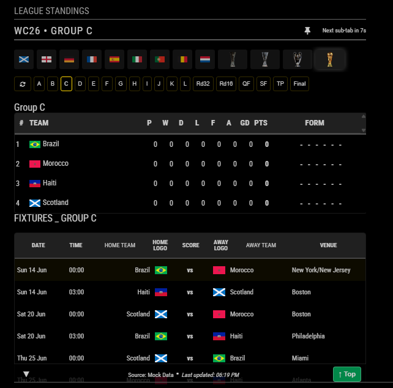
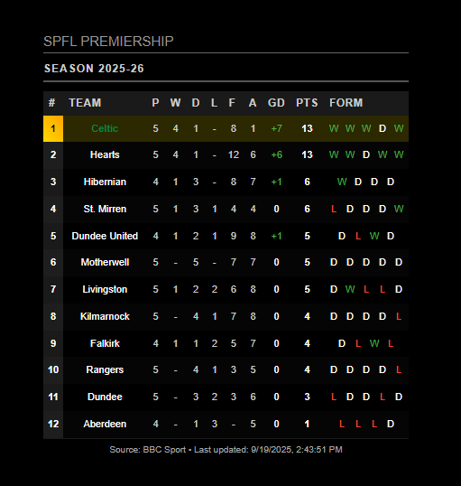
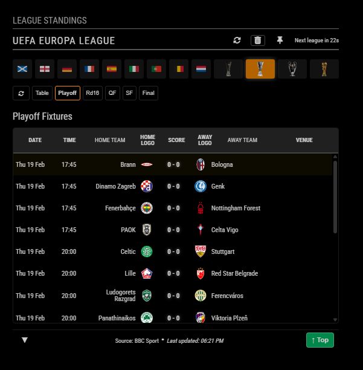
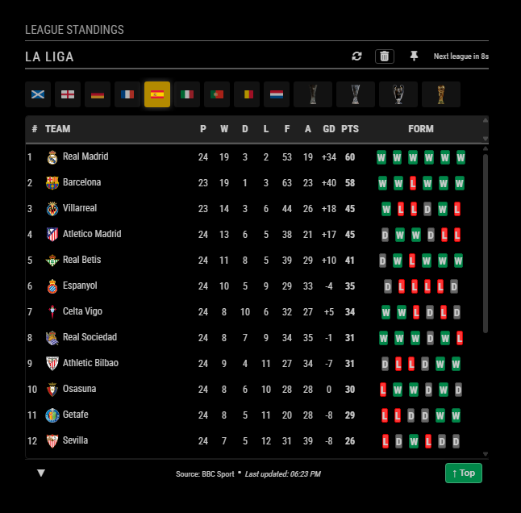
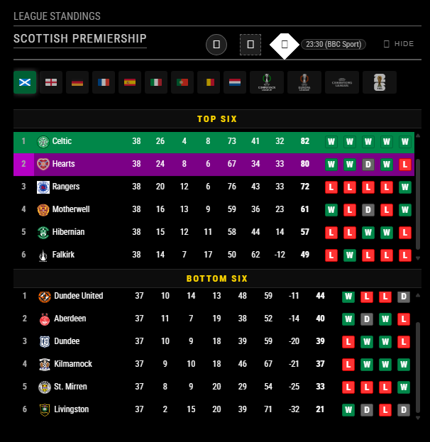
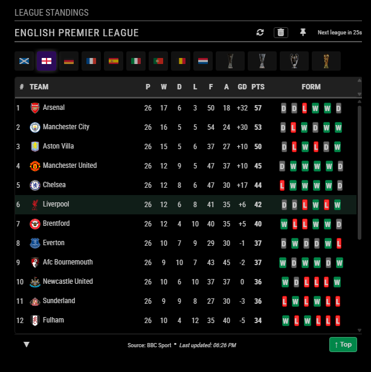
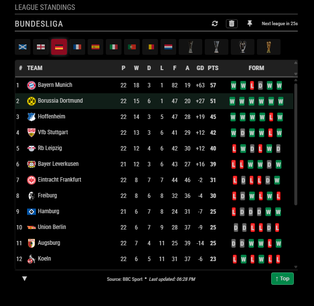

# MMM-MyTeams-LeagueTable

A comprehensive **MagicMirror²** module that displays football league standings from multiple competitions including the FIFA 2026 World Cup , UEFA Champions League (UCL), UEFA Europa League (UEL), UEFA Europa Conference League (ECL), English Premier League (EPL), German Bundesliga,French La Ligue , Italian Serie A , Spanish Primera División, Portuguese Liga, SPFL (Scottish Professional Football League) and Scottish Championship (SPFLC) as well as most other European and World wide leagues, with data sourced from the official website of the BBC Sport with robust fallback data and detailed error handling.

- **Author**: gitgitaway

[](https://magicmirror.builders)
[](https://opensource.org/licenses/MIT)

## 🎬 Screenshots

|                                                  |                                                |                                                |
| :----------------------------------------------: | :--------------------------------------------: | :--------------------------------------------: |
|    |  |  |
|    |  |  |
|    |  |  |
|  |  |  |

## 🆕 Recent Updates (v3.1.1 - 2026-04-22)

**Updated for season 2026-27, nb Europa Conference League data not available untill end of Aug 2026:**

**Enhanced Header Controls & Iconography:**

- **Shape-coded Action Buttons**: Redesigned header buttons for Refresh, Clear Cache, and Pin to use distinctive shapes (Circle, Square, Diamond) for improved accessibility without relying solely on color.
- **Improved Button Order**: Standardised button sequence to **Refresh**, **Clear**, and **Pin** (left-to-right) for a more intuitive user experience.
- **Interaction Refinement**: Added high-visibility `bright` styling (100% opacity), hover scale effects (1.2x), and press feedback (0.9x).
- **Corrected Icon Implementation**: Re-engineered buttons to use dedicated `<i>` elements for Font Awesome icons, ensuring reliable rendering and correct `fa-spin` animation behavior.

## 🆕 Recent Updates (v3.1.0 - 2026-04-18)

**UI/UX Restoration & CSS Alignment:**

- **Standardised HTML Structure**: Reverted all class names in the new modular rendering engine to match the original production CSS, restoring perfect layout parity.
- **Header Meta Info Restored**: Re-implemented the header's last-updated badge and refresh button for improved real-time tracking.
- **High-Quality Fixture Views**: Restored the modern grid-based layout for UEFA and tournament fixtures, replacing the temporary table-based implementation.
- **Enhanced Navigation**: Added clean abbreviations for all major European leagues (BL, L1, LAL, SA, etc.) in the tab navigation buttons.

## 🆕 Recent Updates (v3.0.0 - 2026-04-18)

**Modular Refactor & Performance Optimization (PERF-01):**

- **Architectural Transformation**: Transitioned from a monolithic 6,500-line script to a modern modular system under `src/`.
- **Esbuild Pipeline**: Implemented automated bundling and minification for a 60% reduction in client-side payload.
- **Polymorphic Data Support**: Unified handling of BBC, Soccerway, and FIFA data structures (`standings`, `teams`, `groups`).
- **Path Resolution Fix**: Centralised image asset management in `src/logos.js` with automatic absolute path prepending.
- **Smart Rendering**: Implemented `_shouldSkipRender` logic to minimize DOM thrashing on low-power devices.

## 🆕 Recent Updates (v2.6.0 - 2026-04-16)

**Display Stability & Split-League Robustness:**

- **Eliminated 30-Second Blank Display**: Optimized `processLeagueData()` to only trigger DOM rebuilds for the currently active league, preventing background fetches from causing a blank screen.
- **Fixed Critical TypeError**: Resolved `Uncaught TypeError: self.requestAllLeagueData is not a function` crash in `scheduleUpdate()`.
- **Advanced Split-League Parsing**:
  - **2000-character heading lookback** (up from 500) to reliably find BBC group labels.
  - **Strategy supplementing** to combine traditional `<table>` and modern `div-ARIA` row data for complex multi-group leagues like Belgium.
  - **Size-based partitioning fallback** when explicit group headings are missing but team counts match the league configuration.
- **Improved BBC Resilience**: Added team deduplication and fixed `isDataComplete()` to bypass form-check requirements for split-phase tables.

## 🆕 Recent Updates (v2.5.2 - 2026-04-14)

**Startup Bug Fixes & URL Map Standardisation:**

- **Critical startup crash fixed**: `TypeError: Cannot read properties of undefined (reading 'length')` — `this.currentLeague` was assigned before `determineEnabledLeagues()` ran. Module now starts reliably.
- **Unhandled Promise Rejection fixed**: `ReferenceError: chainInfo is not defined` in `node_helper.js` eliminated.
- **Syntax error fixed**: `NORTH MACEDONIA_FIRST_LEAGUE` space in object key in `european-leagues.js` caused a full script parse failure.
- **All five URL provider maps standardised**: `bbcUrlMap`, `wikipediaUrlMap`, `soccerwayUrlMap`, `googleUrlMap`, and `espnUrlMap` now share identical canonical league codes listed alphabetically. Key mismatches such as `DENMARK_SUPERLIGAEN` → `DENMARK_SUPERLIGA` and `FINLAND_PREMIER_LEAGUE` → `FINLAND_VEIKKAUSLIIGA` resolved.
- **ESPN map fully expanded**: from 28 to 62+ entries, now includes UEFA competitions and legacy `ECL`/`UCL`/`UEL` aliases.

## 🆕 Recent Updates (v2.5.1 - 2026-04-11)

**Enhanced Split-Season Resilience & UI Polish:**

- **Global Split-Season Support**: Greece Super League, Cyprus First Division, and Israel Premier League now support mid-season splits.
- **Awaiting Split Indicator**: Visual **⏳ AWAITING SPLIT** badge in the module header during the transition period.
- **Horizontal Navigation Overhaul**: Styled horizontal scrollbar for league tabs with SVG arrow indicators.
- **Improved Header Controls**: Redesigned **Refresh**, **Clear Cache**, and **Pin** buttons with unified high-visibility styling.

## 🆕 Recent Updates (v2.5.0 - 2026-04-09)

**Multi-Group Split-League Support & Enhanced Resilience:**

- **Simultaneous Group Display**: Leagues that split into Championship and Relegation groups now render all groups together with labeled separators.
- **Wikipedia Multi-Group Parser**: Upgraded to robustly find and parse multiple group tables from a single Wikipedia page.
- **Smart Provider Escalation**: Automatically escalates to a full multi-group source when BBC returns incomplete data.
- **Split-Aware Caching**: Prevents stale single-group data being served after a league split.

See [CHANGELOG.md](./CHANGELOG.md) for complete version history.

## 🏆 Key Features

- **Multi-Provider Support**: Fetch data from **BBC Sport**, **Google Search**, **ESPN**, **Soccerway**, or **Wikipedia** for maximum global coverage.
- **Multi-League Support**: Track 100+ national and international leagues across Europe, the Americas, Asia, and Oceania.
- **Tournament Modes**: Dedicated views for UEFA Champions League and FIFA World Cup 2026.
- **Intelligent Logo Mapping**: Automatic team crest resolution for over 1,700 teams.
- **Performance Optimized**: Server-side processing, async caching, virtual scrolling, and smooth CSS transitions.
- **🔒 Security Hardened**: Zero XSS vulnerabilities with safe DOM manipulation and input validation.
- **♿ Fully Accessible**: WCAG 2.1 Level AAA compliant with screen readers, keyboard navigation, and high contrast mode.
- **🎨 Advanced Customization**: Light/dark themes, table density options, custom team colors, and date filtering.
- **📊 Enhanced UX**: Skeleton loading states, stale data indicators, and categorized error messages.
- **Auto-Cycling**: Automatically rotate between different leagues or tournament groups.
- ✨ **Configurable table density** - Choose compact, normal, or comfortable spacing
- 🎨 **Full light/dark mode** - Auto, light, or dark themes with complete CSS variable system
- 📅 **Fixture date filtering** - Show only today's, this week's, or custom date ranges
- 🎨 **Team color customization** - Apply custom hex colors to specific team rows
- ⚡ **Virtual scrolling** - Performance optimizations for tables with 30+ rows
- 🔧 **Team name normalization** - Fixes BBC Sport truncations ("Atletico" → "Atletico Madrid")

## Requirements & Dependencies

- **MagicMirror²**: v2.1.0 or newer (tested on 2.32.0)
- **Node.js**: v14+ (tested on v22.14.0)
- **Network access**: HTTPS egress to `www.bbc.co.uk`
- **Runtime NPM dependencies**: None (uses Node core modules and MagicMirror core only)
- **Optional Dev Tools** (for local lint/format only; not required to run):
  - `eslint` ^8
  - `prettier` ^2

## Installation

1. Navigate to your MagicMirror's modules folder:

```bash
cd ~/MagicMirror/modules/
```

2. Clone this repository:

```bash
git clone https://github.com/gitgitaway/MMM-MyTeams-LeagueTable.git
```

3. Install dependencies:

```bash
cd modules/MMM-MyTeams-LeagueTable
npm install
```

## Update

```bash
cd ~/MagicMirror/modules/MMM-MyTeams-LeagueTable
git pull
```

## Documentation

## Configuration

To use this module, add it to the modules array in the `~/MagicMirror/config/config.js` file:

### Minimum Configuration

```javascript
{
  module: "MMM-MyTeams-LeagueTable",
  position: "top_right",
  config: {
    selectedLeagues: ["SPAIN_LA_LIGA"]
  }
},
```

### Full Configuration

```javascript
{
 module: "MMM-MyTeams-LeagueTable",
   position: "top_left",
   header: "League Standings", // Set to null  or  "League Standings",
   config: {
    updateInterval: 30 * 60 * 1000, // How often to refresh (ms) – default: 30 min
    retryDelay: 15000, // Delay between retry attempts after an error (ms)
    maxRetries: 3, // Stop retrying after this many failures
    animationSpeed: 2000, // DOM update animation speed (ms)
    fadeSpeed: 4000, // Fade animation speed (ms)
    colored: true, // Color rows by standing (top/UEFA/relegation)
    maxTeams: 36, // 0 = show all teams
    highlightTeams: ["Celtic", "Hearts"], // Emphasize teams by exact name e.g. ["Celtic", "Hearts"],
    scrollable: true, // Enable vertical scrolling if max height exceeded

    // ===== NEW: League Selection System (replaces old individual toggles) =====
    // Method 1: Use selectedLeagues array to choose specific leagues by code
    // Leave empty to use legacy showXXX options, or populate with league codes
    // Example: Scottish Premiership enabled by default
    // Add more league codes here, e.g., "ENGLAND_PREMIER_LEAGUE", "GERMANY_BUNDESLIGA", etc.
    selectedLeagues: [
    "SCOTLAND_PREMIERSHIP",
    "ENGLAND_PREMIER_LEAGUE",
    "GERMANY_BUNDESLIGA",
    "FRANCE_LIGUE1",
    "SPAIN_LA_LIGA",
    "ITALY_SERIE_A",
    "PORTUGAL_PRIMEIRA_LIGA",
    "BELGIUM_PRO_LEAGUE",
    "NETHERLANDS_EREDIVISIE",
    "UEFA_EUROPA_CONFERENCE_LEAGUE",
    "UEFA_EUROPA_LEAGUE",
    "UEFA_CHAMPIONS_LEAGUE",
    "WORLD_CUP_2026" // Enable during World Cup 2026
    ],

    // Method 2: Use legacyLeagueToggle = true to enable old config style (for backward compatibility)
    legacyLeagueToggle: false, // If true, uses showSPFL, showEPL, etc. from config

    // ===== LEGACY League toggles (used if legacyLeagueToggle: true) =====  // Set true to show, false to hide
    showSPFL: true, // Show Scottish Premiership
    showSPFLC: false, // Show Scottish Championship
    showEPL: false, // Show English Premier League
    showUCL: false, // Show UEFA Champions League
    showUEL: false, // Show UEFA Europa League
    showECL: false, // Show UEFA Europa Conference League

    // ===== NEW: Automatic button generation from selectedLeagues =====
    autoGenerateButtons: true, // Auto-create buttons for all leagues in selectedLeagues
    showLeagueButtons: true, // Show/hide league selector buttons in header
    autoFocusRelevantSubTab: true, // Automatically focus on the sub-tab with live or upcoming matches

    // ===== NEW: UEFA League Competitions Specific Options =====
    showUEFAleagues: true, // Set to true to show UEFA leagues in league switcher
    showUEFAnockouts: ["Playoff", "Rd16", "QF", "SF", "Final"], // UEFA knockout stages to show

    // ===== NEW: FIFA World Cup 2026 Specific Options =====
    showWC2026: true, // Set to true to show World Cup 2026 in league switcher
    onlyShowWorldCup2026: false, // If true, only shows World Cup 2026 view
    showWC2026Groups: ["A","B","C","D","E","F","G","H","I","J","K","L"], // Groups to show
    showWC2026Knockouts: ["Rd32", "Rd16", "QF", "SF", "TP", "Final"], // Knockout rounds to show
    defaultWCSubTab: "C", // Default tab to focus on start-up (e.g., "C", "Final", etc.)
    displayAllTabs: true, // Override to show all tabs regardless of stage completion
    useMockData: false, // For testing use only (only for World Cup 2026) for when data not available - Swet to false before competion begins

    // ===== Display Options =====
    showPosition: true, // Show table position
    showTeamLogos: true, // Show team logos
    showPlayedGames: true, // Show games played
    showWon: true, // Show wins
    showDrawn: true, // Show draws
    showLost: true, // Show losses
    showGoalsFor: true, // Show goals for
    showGoalsAgainst: true, // Show goals against
    showGoalDifference: true, // Show goal difference
    showPoints: true, // Show points
    showForm: true, // Show recent form tokens (W/D/L)
    formMaxGames: 6, // Max number of form games to display
    enhancedIndicatorShapes: true, // true = shape-coded tokens (circle/square/triangle); false = colored text only, no background
    firstPlaceColor: "rgb(190, 245, 190)", // Color for the team in first position
    highlightedColor: "rgba(255, 255, 255, 0.1)", // Color for highlighted teams

    // ===== UX Options (Phase 4) =====
    tableDensity: "normal", // Table row density: "compact", "normal", "comfortable"
    fixtureDateFilter: null, // Filter fixtures by date range: null (show all), "today", "week", "month", or {start: "YYYY-MM-DD", end: "YYYY-MM-DD"}
    enableVirtualScrolling: true, // Enable virtual scrolling for large tables (>50 rows)
    virtualScrollThreshold: 10, // Number of rows before virtual scrolling activates


    // ===== Auto-cycling options =====
    autoCycle: true, // Enable auto-cycling between leagues
    cycleInterval: 15 * 1000, // Time to display each league (15 seconds)
    wcSubtabCycleInterval: 20 * 1000, // Time to display each WC sub-tab (groups/knockouts)
    autoCycleWcSubtabs: true, // Allow auto-cycling of World Cup sub-tabs


    // Theme overrides
    darkMode: true, // null=auto, true=force dark, false=force light
    fontColorOverride: "#FFFFFF", // Set to "null" for your existing css colour scheme or override all font colors "#FFFFFF" to force white text
    opacityOverride: null, // null=auto,  set to  1.0 to force full opacity

    // ===== Theme Options (Phase 4) =====
    theme: "auto", // Color theme: "auto" (follows system), "light", "dark"
    customTeamColors: {"Celtic": "#018749", "Hearts": "#ea00ff86"}, // Custom colors for specific teams: {"Team Name": "#HEXCOLOR"}

    // Debug
    debug: false, // Set to true to enable console logging
    dateTimeOverride: null, // Override system date/time for testing. Use ISO date format (e.g., "2026-01-15" or "2026-01-15T14:30:00Z"). null = use system date

    // Cache controls
    clearCacheButton: true,    // Allows user to clear cache from the display
    clearCacheOnStart: false, // Set to true to force-clear ALL caches (disk, fixture, logo) on every module start - useful for development and troubleshooting
    maxTableHeight: 520 // Height in px to show 12 teams
   }
  },
```

See - **[Configuration User Guide](./documentation/Configuration_User_Guide.md)**: for further detailed configuration options.

### Configuration Options

#### Core Options

| Option                    | Default                    | Description                                                                            |
| :------------------------ | :------------------------- | :------------------------------------------------------------------------------------- |
| `updateInterval`          | `1800000` (30m)            | How often to refresh data (milliseconds).                                              |
| `retryDelay`              | `15000`                    | Delay between retry attempts after a fetch error (ms).                                 |
| `maxRetries`              | `3`                        | Maximum fetch retry attempts before giving up.                                         |
| `provider`                | `"auto"`                   | Data source: `"auto"`, `"bbc"`, `"google"`, `"espn"`, `"soccerway"`, or `"wikipedia"`. |
| `animationSpeed`          | `2000`                     | DOM update animation speed (ms).                                                       |
| `fadeSpeed`               | `4000`                     | Fade transition speed (ms).                                                            |
| `selectedLeagues`         | `["SCOTLAND_PREMIERSHIP"]` | Array of league codes to display.                                                      |
| `highlightTeams`          | `["Celtic", "Hearts"]`     | Team names to visually emphasize.                                                      |
| `maxTeams`                | `36`                       | Maximum teams per table (0 = all).                                                     |
| `scrollable`              | `true`                     | Enable vertical scrolling when max height is exceeded.                                 |
| `maxTableHeight`          | `460`                      | Pixel height before vertical scrolling activates.                                      |
| `autoGenerateButtons`     | `true`                     | Auto-create league switcher buttons from `selectedLeagues`.                            |
| `showLeagueButtons`       | `true`                     | Show or hide league switcher tabs in the header.                                       |
| `autoFocusRelevantSubTab` | `true`                     | Automatically focus the tab showing live or upcoming matches.                          |
| `legacyLeagueToggle`      | `true`                     | If `true`, uses legacy `showSPFL` / `showEPL` toggles instead of `selectedLeagues`.    |
| `clearCacheButton`        | `true`                     | Display the Clear Cache button on the module.                                          |
| `clearCacheOnStart`       | `false`                    | Force-clear all caches on every module start (useful for troubleshooting).             |
| `debug`                   | `false`                    | Enable verbose console logging. Disable in production on Raspberry Pi.                 |
| `dateTimeOverride`        | `null`                     | Override system date/time for testing. ISO format e.g. `"2026-06-15T14:00:00Z"`.       |

#### Display Toggles & Display Options

| Option               | Default                   | Description                                                         |
| :------------------- | :------------------------ | :------------------------------------------------------------------ |
| `showPosition`       | `true`                    | Show league rank column.                                            |
| `showTeamLogos`      | `true`                    | Show team crest images.                                             |
| `showPlayedGames`    | `true`                    | Show games played column.                                           |
| `showWon`            | `true`                    | Show wins column.                                                   |
| `showDrawn`          | `true`                    | Show draws column.                                                  |
| `showLost`           | `true`                    | Show losses column.                                                 |
| `showGoalsFor`       | `true`                    | Show goals for column.                                              |
| `showGoalsAgainst`   | `true`                    | Show goals against column.                                          |
| `showGoalDifference` | `true`                    | Show goal difference column.                                        |
| `showPoints`         | `true`                    | Show points column.                                                 |
| `showForm`           | `true`                    | Show recent form tokens (W/D/L).                                    |
| `formMaxGames`       | `6`                       | Number of recent games shown in the form column.                    |
| `colored`            | `true`                    | Color-code rows by zone (promotion / UEFA / relegation).            |
| `highlightedColor`   | `"rgba(255,255,255,0.1)"` | Background color applied to highlighted team rows.                  |
| `fontColorOverride`  | `"#FFFFFF"`               | Override all font colors. Set to `null` to use existing CSS scheme. |
| `darkMode`           | `null`                    | `null` = auto, `true` = force dark, `false` = force light.          |
| `opacityOverride`    | `null`                    | Override table opacity. Set to `1.0` for full opacity.              |

#### Cycling Options

| Option                  | Default       | Description                                                 |
| :---------------------- | :------------ | :---------------------------------------------------------- |
| `autoCycle`             | `false`       | Automatically rotate through selected leagues.              |
| `cycleInterval`         | `15000` (15s) | Time (ms) to display each league when cycling.              |
| `autoCycleWcSubtabs`    | `true`        | Auto-cycle through World Cup sub-tabs (groups / knockouts). |
| `wcSubtabCycleInterval` | `15000`       | Time (ms) to display each World Cup sub-tab.                |

#### Tournament Specific (UEFA European League Competitions)

| Option             | Default                                | Description                                        |
| :----------------- | :------------------------------------- | :------------------------------------------------- |
| `showUEFAleagues`  | `false`                                | Show UEFA competition tabs in the league switcher. |
| `showUEFAnockouts` | `["Playoff","Rd16","QF","SF","Final"]` | UEFA knockout stages to display.                   |

#### Tournament Specific (World Cup 2026)

| Option                 | Default                                             | Description                                               |
| :--------------------- | :-------------------------------------------------- | :-------------------------------------------------------- |
| `showWC2026`           | `false`                                             | Show World Cup 2026 in the league switcher.               |
| `onlyShowWorldCup2026` | `false`                                             | Force the module into dedicated World Cup-only mode.      |
| `showWC2026Groups`     | `["A","B","C","D","E","F","G","H","I","J","K","L"]` | Array of group letters to display.                        |
| `showWC2026Knockouts`  | `["Rd32","Rd16","QF","SF","TP","Final"]`            | Knockout rounds to show.                                  |
| `defaultWCSubTab`      | `"A"`                                               | Tab to focus on at start-up (e.g. `"A"`, `"Final"`).      |
| `displayAllTabs`       | `false`                                             | Show all tabs regardless of stage completion.             |
| `useMockData`          | `false`                                             | Use built-in mock data for testing (World Cup 2026 only). |

#### Accessibility Options

| Option                    | Default | Description                                                                                                                                         |
| :------------------------ | :------ | :-------------------------------------------------------------------------------------------------------------------------------------------------- |
| `enhancedIndicatorShapes` | `true`  | `true` = shape-coded form tokens (circle = W, square = D, triangle = L). `false` = no background; colored text only (W = green, D = grey, L = red). |

#### Advanced Customization Options

| Option                   | Default    | Description                                                                                                           |
| :----------------------- | :--------- | :-------------------------------------------------------------------------------------------------------------------- |
| `tableDensity`           | `"normal"` | Row spacing: `"compact"` (dense), `"normal"` (balanced), or `"comfortable"` (spacious).                               |
| `theme`                  | `"auto"`   | Color theme: `"auto"` (system preference), `"light"`, or `"dark"`.                                                    |
| `fixtureDateFilter`      | `null`     | Filter fixtures by date: `null` (all), `"today"`, `"week"`, `"month"`, or `{start: "YYYY-MM-DD", end: "YYYY-MM-DD"}`. |
| `customTeamColors`       | `{}`       | Custom row background colors per team: `{"Celtic": "#00A650"}`.                                                       |
| `enableVirtualScrolling` | `false`    | Performance optimisation for large tables (30+ rows).                                                                 |
| `virtualScrollThreshold` | `30`       | Row count before virtual scrolling activates.                                                                         |

## ⚽ Available Leagues

Use these codes in your `selectedLeagues` array:

- **UK**: `SCOTLAND_PREMIERSHIP`, `SCOTLAND_CHAMPIONSHIP`, `ENGLAND_PREMIER_LEAGUE`
- **Major Europe**: `GERMANY_BUNDESLIGA`, `SPAIN_LA_LIGA`, `ITALY_SERIE_A`, `FRANCE_LIGUE1`, `NETHERLANDS_EREDIVISIE`
- **Other Europe**: `PORTUGAL_PRIMEIRA_LIGA`, `BELGIUM_PRO_LEAGUE`, `TURKEY_SUPER_LIG`, `GREECE_SUPER_LEAGUE`, `AUSTRIA_BUNDESLIGA`, `CZECH_LIGA`, `DENMARK_SUPERLIGAEN`, `NORWAY_ELITESERIEN`, `SWEDEN_ALLSVENSKAN`, `SWITZERLAND_SUPER_LEAGUE`, `UKRAINE_PREMIER_LEAGUE`, `ROMANIA_LIGA_I`, `CROATIA_HNL`, `SERBIA_SUPER_LIGA`, `HUNGARY_NBI`, `POLAND_EKSTRAKLASA`
- **International/UEFA**: `UEFA_CHAMPIONS_LEAGUE`, `UEFA_EUROPA_LEAGUE`, `UEFA_EUROPA_CONFERENCE_LEAGUE`, `WORLD_CUP_2026`

## 🛡️ Security: Content Security Policy (CSP)

For MagicMirror deployments running in security-restricted environments (enterprise kiosks, embedded displays), add these CSP directives:

| Directive     | Value                                               |
| :------------ | :-------------------------------------------------- |
| `script-src`  | `'self'`                                            |
| `img-src`     | `'self' data:`                                      |
| `connect-src` | `'self' https://www.bbc.co.uk https://www.fifa.com` |
| `style-src`   | `'self' 'unsafe-inline'`                            |

```
Content-Security-Policy: default-src 'self'; script-src 'self'; img-src 'self' data:; connect-src 'self' https://www.bbc.co.uk https://www.fifa.com; style-src 'self' 'unsafe-inline';
```

> **Note**: All network requests are made server-side by `node_helper.js`. No external scripts or fonts are loaded by this module. See [Advanced Customization](./documentation/Advanced_Customization.md) for full CSP details.

## 📚 Detailed Documentation

### Getting Started & Configuration

- **[Configuration User Guide](./documentation/Configuration_User_Guide.md)**: All configuration options with defaults and descriptions.
- **[European Leagues Config](./documentation/EUROPEAN_LEAGUES_CONFIG.md)**: Complete guide to selecting and enabling leagues.
- **[Advanced Customization](./documentation/Advanced_Customization.md)**: CSS variables, custom logos, and theme overrides.

### Architecture & How It Works

- **[How This Module Works](./documentation/How_This_Module_Works.md)**: Architectural overview — parsers, caching, split-leagues, and provider factory.
- **[Data Provider Guide](./documentation/fetchProvider.md)**: Choosing between BBC, ESPN, Wikipedia, Google, and Soccerway.
- **[League Split Guide](./documentation/leagueSplits_Guide.md)**: How mid-season splits (Scotland, Romania, Greece, etc.) are handled.
- **[Shared Request Manager](./documentation/SHARED_REQUEST_MANAGER.md)**: Technical details of the throttled data-fetching system.
- **[Cache System](./documentation/CACHE_QUICKSTART.md)**: Multi-tier memory and disk caching explained.

### League & Provider Reference

- **[BBC Sport League Pages](./documentation/bbcLeaguesPages.md)**: All leagues available via BBC Sport with canonical config codes.
- **[ESPN League Pages](./documentation/espnLeaguesPages.md)**: ESPN-supported leagues and URL codes.
- **[Wikipedia League Pages](./documentation/wikipediaLeaguesPages.md)**: Season-specific Wikipedia URLs for all supported leagues.
- **[Google League Pages](./documentation/googleLeaguePages.md)**: Google Search fallback query URLs.
- **[Soccerway League Pages](./documentation/soccerwayLeaguesPages.md)**: Soccerway season IDs for confirmed leagues.

### Tournaments

- **[World Cup 2026 Guide](./documentation/WorldCup2026-UserGuide.md)**: Full configuration guide for FIFA World Cup 2026 display.

### User Guides

- **[Troubleshooting](./documentation/Troubleshooting_User_Guide.md)**: Diagnosing and fixing common issues.
- **[Debug Guide](./documentation/Debug_Guide.md)**: How to enable and interpret debug logs.
- **[Accessibility Features](./documentation/Accessibility_Features.md)**: Screen reader and keyboard navigation support.
- **[Translation Guide](./documentation/Translation-Guide.md)**: Adding or updating language translations.
- **[Mock Data Guide](./documentation/MOCK_DATA_GUIDE.md)**: Testing the module without live data.

### Developer & Project Files

- **[Module Review](./documentation/moduleReview.md)**: Code quality audit with implementation status.
- **[Maintenance Guide](./documentation/maintenance.md)**: Seasonal URL updates and logo management.
- **[Changelog](./CHANGELOG.md)**: Full history of changes and versions.
- **[License](./LICENSE)**: MIT License details.
- **[Code of Conduct](./documentation/Code_Of_Conduct.md)**: Contributor guidelines.

### License & Terms of Service

This module is licensed under the **MIT License**.

> [!WARNING]
> **Data Scraping & Terms of Service**: This module fetches data from BBC Sport, FIFA, Wikipedia, and other public sources using web scraping techniques. While the module includes intelligent throttling and user-agent rotation to be a good citizen, please be aware that high-frequency updates or multiple instances may violate the Terms of Service of these providers. Use this module at your own risk. The author is not responsible for any IP blocks or service disruptions.

### Acknowledgments

Thanks to the MagicMirror community for inspiration and guidance!
Thanks to the BBC for providing free access to their sports pages.

### License

MIT
